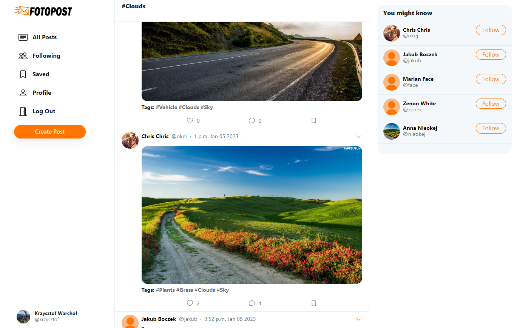
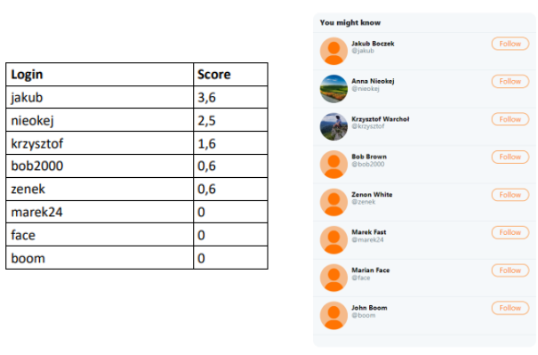
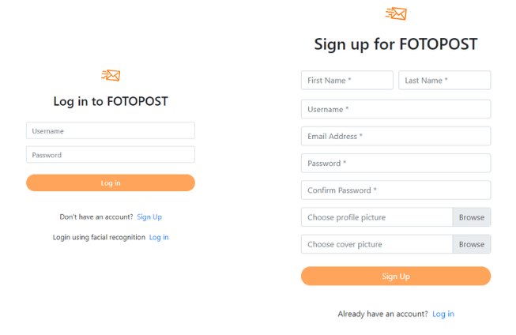
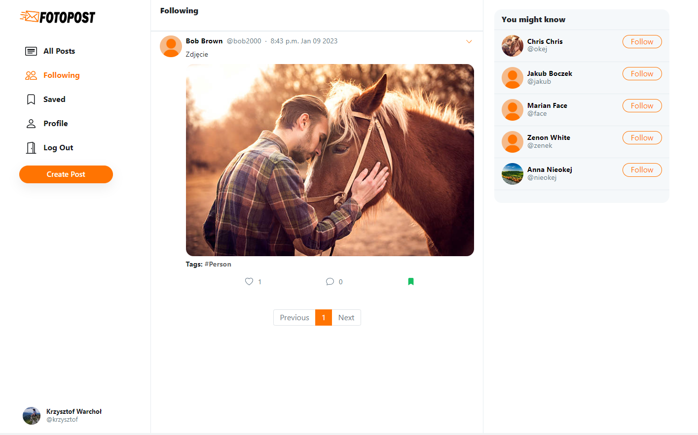
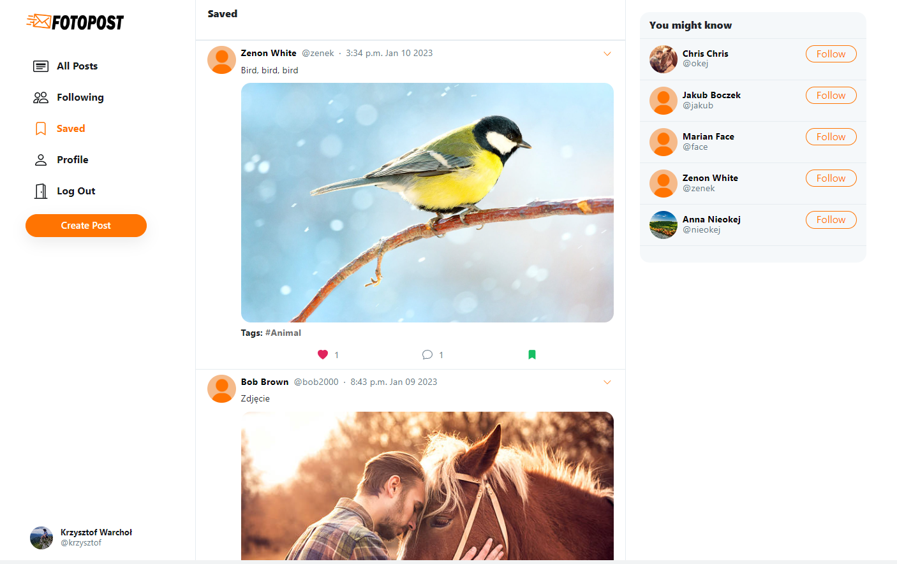
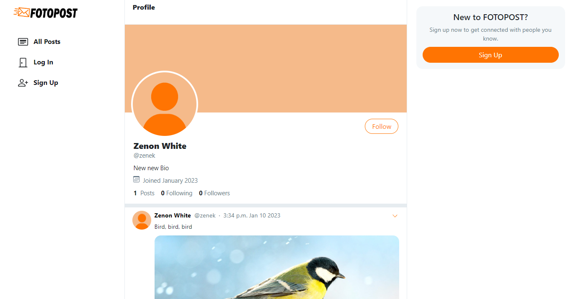
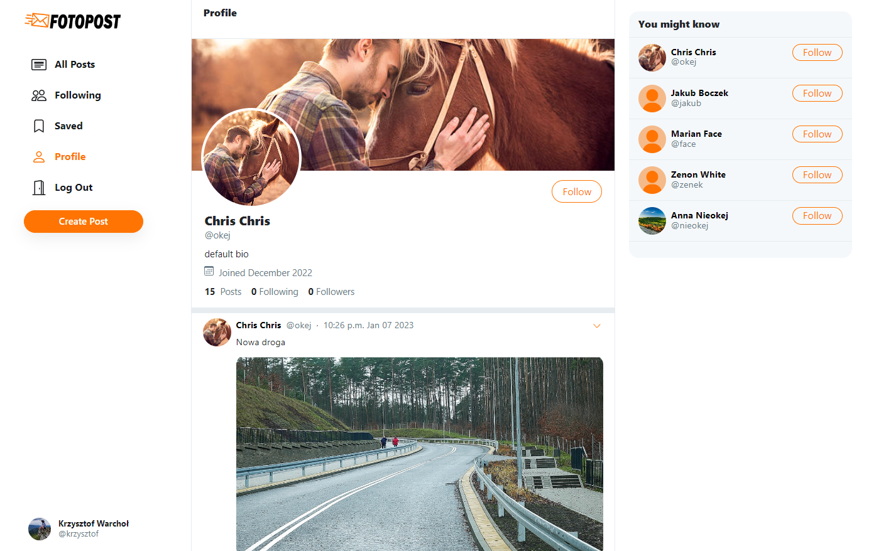

# FOTOPOST

FOTOPOST is a smart web application designed to provide users with a personalized and interactive social experience. It allows users to upload, explore, and engage with images that match their interests. By integrating AI technologies, FOTOPOST offers features such as facial recognition alternative login, automatic image tagging, and a recommendation system that connects users with similar interests.



## Table of Contents
- [Features](#features)
- [AI Features](#ai-features)
- [Other features](#other-features)
- [Installation and run](#installation-and-run)
- [Screenshots](#screenshots)

## AI Features 
### 1. Facial Recognition Login
FOTOPOST provides alternative login method using facial recognition technology. This feature ensures seamless and quick access to the app. App uses OpenCV's Haar Cascade classifier to detect faces and the Local Binary Patterns Histograms (LBPH) algorithm for face recognition. 

Flow of the Face Recognition Process:

- **Face Registration**: Users first capture images of their face, which are saved and used to train the model.
- **Model Training**: The LBPH model is trained with the user’s face images to recognize the user in future sessions.
- **Face Login**: The model is used to predict the identity of the user based on real-time face detection, allowing them to log without needing to input a password.

### 2. Multi-label Image Classification (Posts Tagging)
 Leveraging a pre-trained ResNeXt50 deep learning model, FOTOPOST automatically categorizes user-uploaded images with multiple relevant tags, making it easier to organize and explore content. 
 
 To train the model responsible for multi-label classification, the publicly available **NUS-WIDE** dataset was used. This dataset contains images from the "Flickr" social media platform, along with corresponding labels representing various categories.

Due to the imbalanced nature of the dataset, 6,000 samples were selected for training, focusing on 27 of the most frequently occurring categories. Each category had at least 100 samples. The dataset was divided as follows:
- **Training set:** 5,000 images
- **Test set:** 1,000 images 

### 3. User Recommendation System
The recommendation system in FOTOPOST is designed to suggest users for following, based on the content they share. 

Key Features of the Recommendation System:
1. ***Content-Based Filtering Algorithm***: The recommendation engine relies on content-based filtering, which suggests users to follow based on the type of content (posts) they share. It compares the categories of images posted by the target user with those of other users who are not yet followed.

2. ***Scoring Mechanism***: The system calculates a recommendation score for each potential user to follow. This score is based on two factors:

    - **Tagged Post Count**: The number of posts a user has shared within a specific category.
    - **Tagged Likes per Post**: The average number of likes a user's posts have received in that category.

    These values are combined using the formula:

        score = (tagged_post_count × 0.5) + (tagged_likes_per_post × 0.1)

The system generates a list of the top ten users with the highest recommendation scores. This list is presented in the "You might know" table for each logged-in user, ranking potential users to follow by their relevance. The higher the score, the higher the user appears in the table.



## Other features 
- View all posts added in the app.
- View posts saved by the user.
- View posts added by followed users.
- View posts from a selected category.
- View posts from a specific user.
- Add a post.
- Display user profiles.
- Edit user profiles.
- Follow other users.
- Delete a created post.
- Comment on posts.
- Like posts.
- Save posts.

## Installation and run

1. Clone the repository:
   ```bash
   git clone https://github.com/fotopost.git
   cd your-repo
   ```
2. Download pretrained model: https://drive.google.com/file/d/1H9oeLivUsQOTykhhV8OabGLnXZpVuBJD/view?usp=sharing and add it to folder ```app\ml_model```
3. Create and activate ``venv``.
4. Install the required dependencies:
    ```bash
    pip install -r requirements.txt
    ```
5. Apply migrations using specified database connection:
    ```bash
    py manage.py migrate
    ```
6. Run the following command:
    ```bash
    py manage.py runserver 
    ```
7. Open your web browser and go to ```http://localhost:8000```.


## Screenshots









